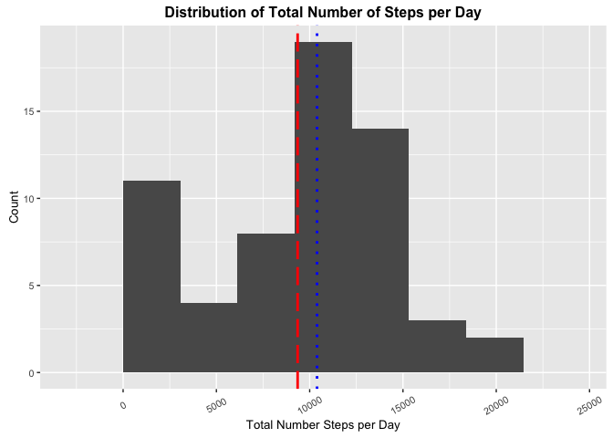

# Reproducible Research: Peer Assessment 1
Brett A. Ochs  
Loading packages "dplyr" and "ggplot2" done with include="FALSE" to restrict package loading messages.

## Loading and preprocessing the data


Unzip and read in activity.csv from working directory into data frame.


```r
options(scipen = 5, digits = 1)
df.raw <- read.csv(unz("activity.zip", "activity.csv"))
summary(df.raw)
```

```
##      steps              date          interval   
##  Min.   :  0    2012-10-01:  288   Min.   :   0  
##  1st Qu.:  0    2012-10-02:  288   1st Qu.: 589  
##  Median :  0    2012-10-03:  288   Median :1178  
##  Mean   : 37    2012-10-04:  288   Mean   :1178  
##  3rd Qu.: 12    2012-10-05:  288   3rd Qu.:1766  
##  Max.   :806    2012-10-06:  288   Max.   :2355  
##  NA's   :2304   (Other)   :15840
```

## What is mean total number of steps taken per day?

Use the dplyr summarize function to calculate average steps per day without removing "NA"" values. Then use ggplot2 histogram to plot frequencies of steps per day counts. "NA"s were removed from mean and median calculations plotted on graph and called out in text below.


```r
## Make summary data frame to plot histogram of average steps per day
df.raw.summary <- tbl_df(df.raw) %>%
    group_by(date) %>%
    summarize(Avg.Steps = sum(steps, na.rm=TRUE))

## Determine binwidth for ggplot2 implementation of histogram using Freedman-Diaconis rule
bw <- (2 * IQR(df.raw.summary$Avg.Steps) / length(df.raw.summary$Avg.Steps)^(1/3))

## Plot histogram of average steps per day counts and format appropriately
ggplot(df.raw.summary) + geom_histogram(aes(x=Avg.Steps), binwidth=bw) + 
    geom_vline(xintercept=mean(df.raw.summary$Avg.Steps, na.rm=TRUE), 
               linetype="longdash", colour="red", size=1) +
    geom_vline(xintercept=median(df.raw.summary$Avg.Steps, na.rm=TRUE), 
               linetype="dotted", colour="blue", size=1) + 
    labs(title="Distribution of Total Number of Steps per Day", 
         x="Total Number Steps per Day", y="Count") + 
    theme(axis.text.x=element_text(angle=30, vjust=0.5, size=8),
          axis.text.y=element_text(size=8),
          axis.title=element_text(size=10),
          plot.title=element_text(size=12, face="bold"), legend.position="bottom")
```



While we see many missing values "NA"s showing up as zeros in this graph, we can remove "NA"s to calculate mean and median values for the data set.

- The mean number of steps per day of raw data is **9354** steps and is shown in red dashed line on above graph.

- The median number of steps per day of raw data is **10395** steps and shown in blue dotted line on above graph.

## What is the average daily activity pattern?


```r
df.raw.time.summary <- df.raw %>%
    mutate(Time = str_pad(df.raw$interval, 4, pad="0"),
           DateTime = paste0("2015-03-11", " ", Time), # Fake date to use lubridate
           TrialInterval = ymd_hm(DateTime)) %>% 
    group_by(TrialInterval) %>%
    summarize(Reps = n(),
              Steps = mean(steps, na.rm=TRUE),
              Interval = unique(interval))
ggplot(df.raw.time.summary, aes(x=TrialInterval, y=Steps)) + geom_line() + 
    scale_x_datetime(labels=date_format("%I:%M %P")) +
    labs(title="Average Daily Step Activity Pattern Across All Days", 
         x="Time of Day", y="Average Number Steps") + 
    theme(axis.text.x=element_text(angle=30, vjust=0.5, size=8),
          axis.text.y=element_text(size=8),
          axis.title=element_text(size=10),
          plot.title=element_text(size=12, face="bold"), legend.position="bottom")
```


Note the heaviest spike around upward trends of graph from 6:00 AM to 9:00 AM when people are waking and heading to school or work!

## Imputing missing values

There are a total of **$2304$** rows of data missing "steps" observations (i.e. steps = NA) out of **$17568$** total rows in dataset.


```r
df.imputed <- tbl_df(df.raw) %>%
    mutate(Imp.Steps = as.integer(ifelse(is.na(df.raw$steps) == TRUE, df.raw.time.summary$Steps[df.raw.time.summary$Interval %in% df.raw$interval], df.raw$steps)))
df.imputed.summary <- tbl_df(df.imputed) %>%
    group_by(date) %>%
    summarize(Avg.Steps = sum(Imp.Steps, na.rm=TRUE))
```


```r
## Determine binwidth for ggplot2 implementation of histogram using Freedman-Diaconis rule
bw <- (2 * IQR(df.imputed.summary$Avg.Steps) / length(df.imputed.summary$Avg.Steps)^(1/3))

ggplot(df.imputed.summary) + geom_histogram(aes(x=Avg.Steps), binwidth=bw) + 
    geom_vline(xintercept=mean(df.imputed.summary$Avg.Steps, na.rm=TRUE), 
               linetype="longdash", colour="red", size=1) +
    geom_vline(xintercept=median(df.imputed.summary$Avg.Steps, na.rm=TRUE), 
               linetype="dotted", colour="blue", size=1) +
    labs(title="Distribution of Total Number of Steps per Day- Impute Missing Values", 
         x="Total Number Steps per Day", y="Count") + 
    theme(axis.text.x=element_text(angle=30, vjust=0.5, size=8),
          axis.text.y=element_text(size=8),
          axis.title=element_text(size=10),
          plot.title=element_text(size=12, face="bold"), legend.position="bottom")
```


The mean number of steps per day of imputed data is **10750** steps and is shown in red dashed line on above graph.

The median number of steps per day of imputed data is **10641** steps and shown in blue dotted line on above graph.


```r
## Graph imputed dataset
df.imputed.time.summary <- df.imputed %>%
    mutate(Time = str_pad(df.imputed$interval, 4, pad="0"),
           DateTime = paste0("2015-03-11", " ", Time), # Fake date to use lubridate
           TrialInterval = ymd_hm(DateTime)) %>% 
    group_by(TrialInterval) %>%
    summarize(Reps = n(),
              Steps = mean(Imp.Steps, na.rm=TRUE),
              Interval = unique(interval))
ggplot(df.imputed.time.summary, aes(x=TrialInterval, y=Steps)) + geom_line() + 
    scale_x_datetime(labels=date_format("%I:%M %P")) +
    labs(title="Average Daily Step Activity Pattern Across All Days- Impute Missing Values", 
         x="Time of Day", y="Average Number Steps") + 
    theme(axis.text.x=element_text(angle=30, vjust=0.5, size=8),
          axis.text.y=element_text(size=8),
          axis.title=element_text(size=10),
          plot.title=element_text(size=12, face="bold"), legend.position="bottom")
```


## Are there differences in activity patterns between weekdays and weekends?


```r
df.imputed.weekly <- df.imputed %>%
    mutate(day = wday(ymd(df.imputed$date), label=TRUE),
           Week.Class = ifelse(day %in% c("Sat", "Sun"), "Weekend", "Weekday"))
df.imputed.weekly.summary <- df.imputed.weekly %>%
    mutate(Time = str_pad(df.imputed$interval, 4, pad="0"),
           DateTime = paste0("2015-03-11", " ", Time), # Fake date to use lubridate
           TrialInterval = ymd_hm(DateTime)) %>% 
    group_by(TrialInterval, Week.Class) %>%
    summarize(Reps = n(),
              Steps = mean(Imp.Steps, na.rm=TRUE),
              Interval = unique(interval))
ggplot(df.imputed.weekly.summary, aes(x=TrialInterval, y=Steps)) + geom_line() + 
    scale_x_datetime(labels=date_format("%I:%M %P")) + facet_grid(Week.Class ~ .)
```


